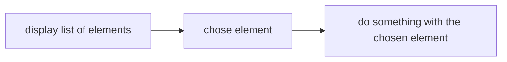
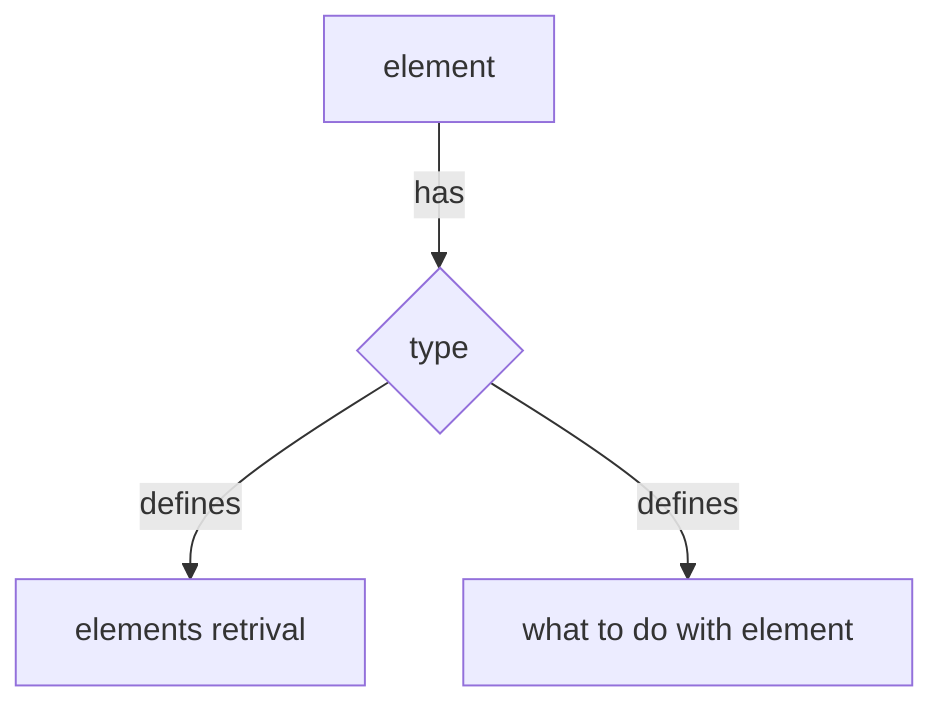
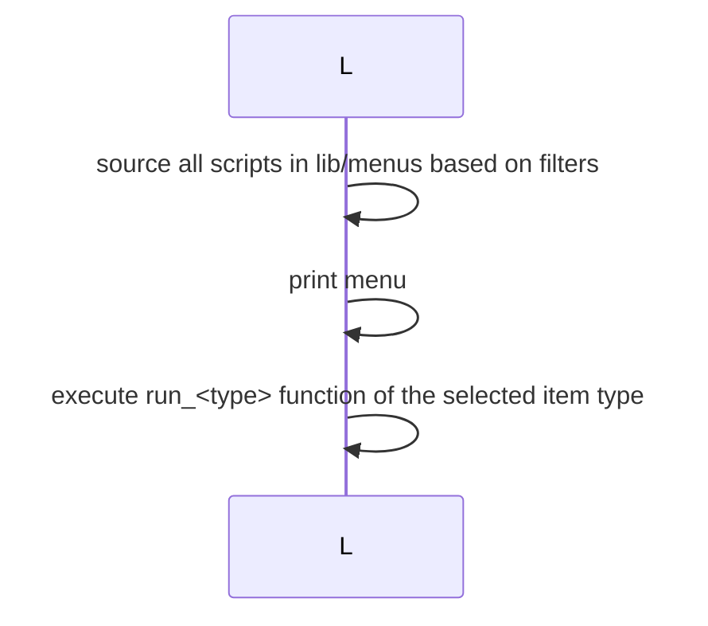

# Menu engine

One of the most important utilities in the repository is the universal menu engine to avoid using interactive menus that require a mouse pointer, the utility is inspired by the various `dmenu` replacements and it can use one of them as a backend to display item lists, the concept is simple:




> [!WARNING]
> For example a menu could display sites and open them in the browser and another one could display password elements from the password store and copy one of them in the clipboard :)


The advantage in a similar approach is that there is an **homogeneous way** to access most common operations that a user does with a desktop environment

## The `L.sh` utility

The menu utility has the following requirements

- It has to be fast ⚡
- It must be extensible with new items and new operations to run on that items
- It must filter types of object to display

In order to accomplish this requirements the utility follows a domain model where the menu items are called `elements` that are defined by a `type` which indicates how elements has to be retrieved from the system and what the system has to do with the selected `element`



### Usage

The utility is called as follows:

```bash
L.sh -b [backend] [lists of types]
```

Where:

- `backend` is the program that has to print the elements on display, all `dmenu` replacement are valid options, (*default is defined in the [configuration file](/configuration) `MENU_BACKEND`*)
> [!ALERT]
> When called from the [hyprland](https://hyprland.org) bindings the script will use a different backend that the one defined in the configuration file !!!!

- `list of types` is a list of types to be considered when searching elements to display (*default behavior is to print all known types*) the elements type are defined as files in the `$HOME/.local/lib/menus/` directory and are defined as follows


>`$HOME/.local/lib/menus/type.sh`
```bash
#!/bin/bash
source "$HOME/.config/scripts/settings.sh"

# this function  must print the elements to select from in the format type:element, to add type use sed 's/^/type:/g'
list_type(){ }

# this function is invoked when the element is selected with it as first argument:
# run_type SELECTED_ELEMENT
run_type(){ }
```

### Implemented types

The repository contains a set of already implemented type:

- `app` launch exec binaries of `.desktop` files
- `btdevice` connect to bluetooth devices
- `clipboard` get content from the clipboard history
- `file` open files
- `ghpage` open github pages site of a given repository
- `ghrepo` open github repository page
- `ksprofile` switch between [kanshi](https://sr.ht/~emersion/kanshi/) profiles
- `network` connect to wifi networks
- `notification` display notifications
- `otp` copy otp codes [pass-otp integration](https://github.com/tadfisher/pass-otp#readme) for [password store](https://www.passwordstore.org/)
- `password` copy a password store in a [password store](https://www.passwordstore.org/)
- `site` open a firefox tab in a given site
- `s` open sites
- `sgame` open steam games
- `system` power management options
- `vault` open obsidian vault with obsidian
- `wallpaper` change wallpaper
- `window` move focus to a specific window
- `track` play tracks from subsonic server
- `album` play albums from subsonic server
- `playlist` play playlist from subsonic server

#### password menus configuration

The password menu can show password from multiple password repositories, set the `PASSWORD_STORES`, see [configuration section](configuration.md)

#### Github menus configuration

To use github menus correctly you must login to github-cli

```bash
gh auth login
```

#### Adding sites to the `site` type

The `site` type load the sytes to display from a file in the filesystem at the following paths

- `~/.local/lib/sites.json` this is a default under version control that **should NOT be edited** and should be used as reference instead
- `~/.local/lib/sites.json.d` this is a directory for extra `sites.json` files that are installation specific

So in order to add a site do as follows

> inside `$HOME/.local/lib/sites.json.d/mysites.json`
```json
[
  { "site": "my-site","link": "https://mysite.com"}
]
```

Where:

- `site` field is the name displayed inside the menu
- `link` field is the site url to open with firefox

### Add custom types in menus

To add custom types create a file in the `$HOME/.local/lib/menus` directory following the structure above

### Runtime

The menu is structured as follows, the [L script](../bin/L.sh) load sources based on filters given as parameters an get data from each sources in parallel, then it prints the menu and run the action specified by the item type


