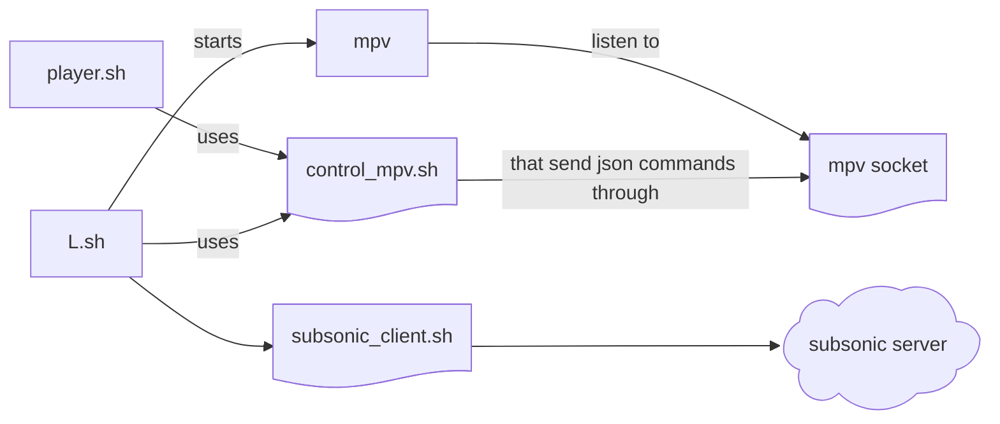

# Music player

The repository contains a series of scripts that interacts together to play music from a [subsonic](https://www.subsonic.org/pages/api.jsp) compatible server the scripts interacts together as follows



> [!NOTE]
> Why this? Cause it's fun obviously 😜

`mpv` is treated as a daemon process started from [L.sh](./menu_engine.md) script, using the `album` `artist` and `playlist` types, and subsequent scripts that dialog with `mpv` use the socket channel to communicate, this scripts are also bind to some hyprland keybindings

## Authentication

Authentication through the subsonic server is done with username and password that need to be configured in the [configuration file](./configuration.md) using the following variables

```bash
SUBSONIC_API_ENDPOINT=""
SUBSONIC_USERNAME=""
SUBSONIC_PASSWORD=""
```
