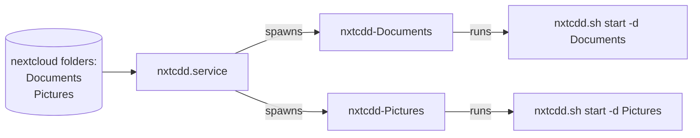

# Systemd templates scripts

Some tools need to run as daemons and monitor folders such as [the script for nextcloud synchronization](../bin/nxtcdd.sh) and the [folder manager](../bin/folder_manager.sh), this scripts are implemented using systemd template units functionality to spawn multiple instances of the daemon and manages different directories:

## Add systemd services in the configuration file

To enable systemd user template units at installation time edit `TEMPLATE_SERVICES` in the [configuration file](configuration.md)
