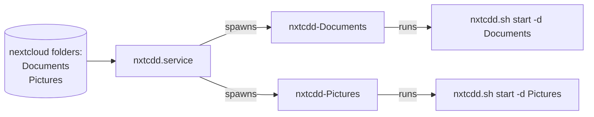

## Development documentation

>[!WARNING]
> this documentation is for development only

### Systemd templates scripts

Some tools need to run as daemons and monitor folders such as [the script for nextcloud synchronization](bin/nxtcdd.sh) and the [folder manager](bin/folder_manager.sh), this scripts are implemented using systemd template units functionality to spawn multiple instances of the daemon and manages different directories:

