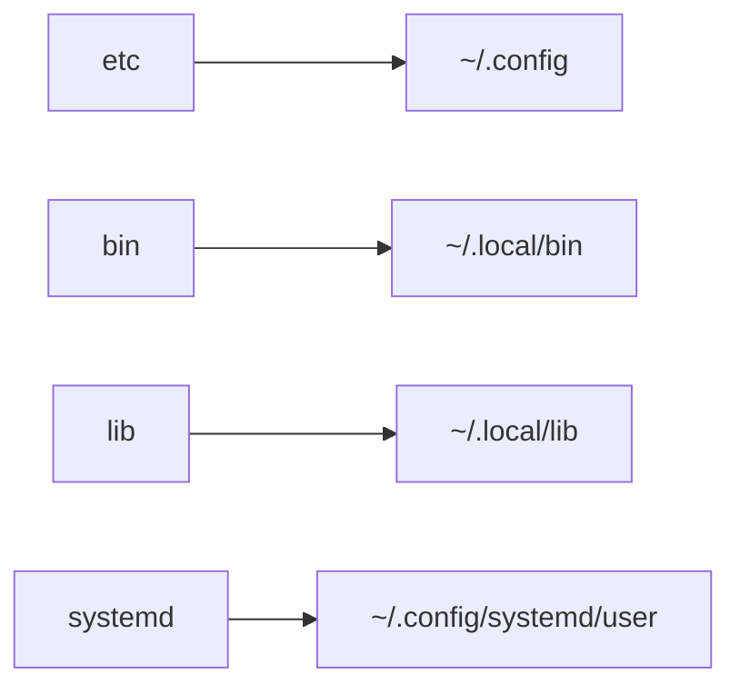

# SCRIPTS

Personal dotfiles (wayland configuration) + some useful scripts and tools for everyday use

## INSTALLATION

To install :

- clone the repository

```bash
git clone https://github.com/carnivuth/scripts "$HOME/scripts"
```

- copy default configurations

```
# SOURCE SAMPLE FILE TO import default configs
echo 'source $HOME/.config/scripts/settings.sh.sample' > $HOME/scripts/etc/.config/settings.sh
cat $HOME/scripts/etc/.config/settings.sh.sample >> $HOME/scripts/etc/.config/settings.sh
```

- run the installation script (**arch linux only**)

```
cd $HOME/scripts.sh && ./scripts.sh
```

### HOW IT WORKS

this will install dependencies and link the dotfiles under the right folder using [stow](https://www.gnu.org/software/stow/), for reference



In order to add aliases and set path the following line is added to `~/.bashrc`

```bash
source $HOME/.config/scripts/bash_integration.sh
```

### FIREFOX

In order to configure firefox additional steps are required

- enable this firefox options inside `about:config` section

```
toolkit.legacyUserProfileCustomizations.stylesheets
layers.acceleration.force-enabled
gfx.webrender.all
gfx.webrender.enabled
layout.css.backdrop-filter.enabled
svg.context-properties.content.enabled
```

- link firefox configuration file to the profile directory

```bash
mkdir -p ~/.mozilla/firefox/<profiledir>/chrome
ln -sf firefox/userChrome.css ~/.mozilla/firefox/<profiledir>/chrome
```

- install sidebery extension end import `firefox/sidebary.json`

### THUNDERBIRD

In order to add thunderbird catppuccin theme follow these steps

- clone theme [repo](https://github.com/catppuccin/thunderbird)

```bash
cd /tmp
git clone https://github.com/catppuccin/thunderbird
```

- install theme from the thunderbird UI

## CONFIGURATION

configuration is done in the `$HOME/.config/settings.sh` file, see the `.sample` (version for reference) all binaries load the configuration file and use the setted variables

## SUPPORTED SYSTEMS

the repo is tested on arch linux, it should work on other distros if you install the dependencies listed in the `./scripts.sh` script
