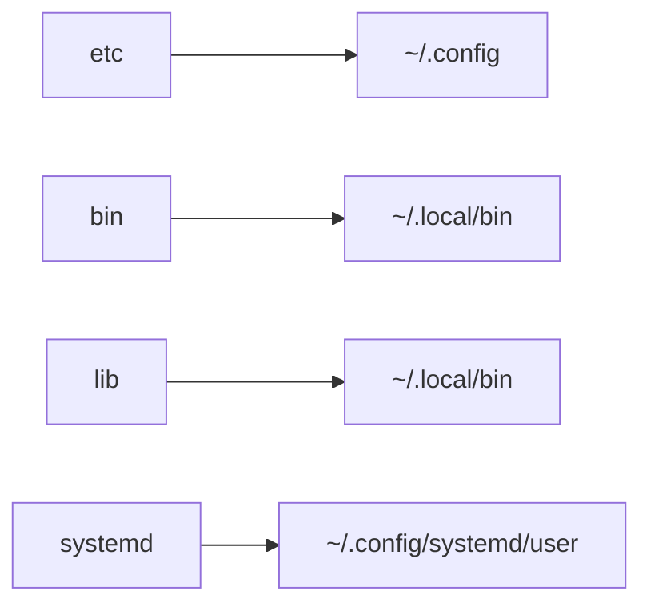

# SCRIPTS

personal dotfiles (wayland configuration) + some usefull scripts and tools for everyday use

## INSTALLATION

to install :

- clone the repository

```bash
git clone https://github.com/carnivuth/scripts "$HOME/scripts"
```

- copy default configurations

```
cp $HOME/scripts/etc/.config/settings.sh.sample $HOME/scripts/etc/.config/settings.sh
```

- run the installation script (**arch linux only**)

```
cd $HOME/scripts.sh && ./scripts.sh
```

this will install dependencies and link the dotfiles under the right folder using [stow](https://www.gnu.org/software/stow/), for reference



## CONFIGURATION

configuration is done in the `$HOME/.config/settings.sh` file, see the `.sample` (version for reference) all binaries load the configuration file and use the setted variables

## SUPPORTED SYSTEMS

the repo is tested on arch linux, it should work on other distros if you install the dependencies listed in the `./install.sh` script
