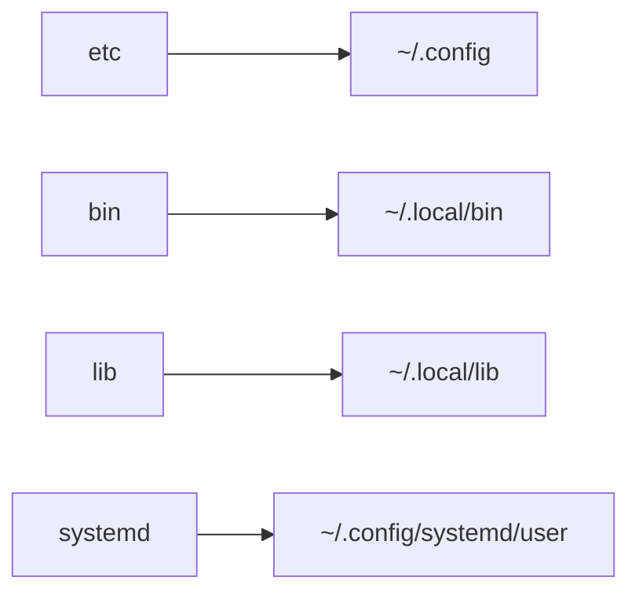

# SCRIPTS

Personal dotfiles (wayland configuration) + some useful scripts and tools for everyday use

## Features

The repo contains a bunch of scripts and utilities for day to day use, it's almost as a fully desktop environment (at least for my use case 😅)

### Systemd units and timers

- backup script using `borg` and `rsync`
- github synchronization utility
- system updates notification daemon
- battery manager script
- `newsboat` notification daemon
- `ntfy` notification client
- mount volumes with `rclone` utility
- daemon for weather forecasts

### Menus

- Bluetooth menus
- clipboard menu
- github  menus for quick access to github repos and github pages
- `kanshi` profiles menu
- application and websites launcher
- menu for quick connection to networks
- menu for quick access to obsidian vaults
- menu for pass password manager
- power options menu
- quick browse on `firefox` applet
- file opener menu
- steam games launcher

### General command line utilities

- utility for wireguard vpn connection
- utility for screen recording
- obsidian vault manager script
- utilities for cleanup of docker/vagrant/ollama data
- utility for managing audio/video file conversion and common operations
- caffeine mode
- git common utilities

## Installation

To install:

- clone the repository

```bash
git clone https://github.com/carnivuth/scripts "$HOME/scripts"
```

- run the installation script (**arch linux only**)

```
cd $HOME/scripts && ./scripts.sh
```

### Configure greeter

The installation scripts install greetd as a login daemon and hyprland and sway as window managers, configuration is done for both the environments (hyprland is more updated since is my default one), to set one of them as default program after login change `/etc/greetd/config.toml` as follows

```toml
[terminal]

vt = 1

[default_session]

# run hyprland on login
#command = "agreety --cmd /bin/Hyprland"

# run sway on login
#command = "agreety --cmd /bin/sway"

# login with tuigreet
command = "tuigreet --remember --remember-user-session"

user = "greeter"
```

To unlock the gnome keyring at default set this on the `/etc/pam.d/greetd` file

```
#%PAM-1.0

auth       required     pam_securetty.so
auth       requisite    pam_nologin.so
auth       include      system-local-login
auth       optional     pam_gnome_keyring.so
account    include      system-local-login
session    include      system-local-login
session    optional     pam_gnome_keyring.so auto_start
```

### Configure updates

The installation scripts creates a git hook that runs on merge event and execute the `./scripts.sh` installation script, to avoid input password for pacman configure sudo as follows

```bash
echo "$USER ALL=(ALL:ALL) NOPASSWD:/bin/pacman" > "/etc/sudoers.d/$USER"
```

### How it works

This will install a list of default packages and link the configuration files under the right folder using [stow](https://www.gnu.org/software/stow/), for reference



In order to add aliases and set path the following line is added to `~/.bashrc`

```bash
source $HOME/.config/scripts/bash_integration.sh
```

### Firefox

In order to configure firefox additional steps are required

- enable this firefox options inside `about:config` section

```
toolkit.legacyUserProfileCustomizations.stylesheets
layers.acceleration.force-enabled
gfx.webrender.all
gfx.webrender.enabled
layout.css.backdrop-filter.enabled
svg.context-properties.content.enabled
```

- link firefox configuration file to the profile directory

```bash
mkdir -p ~/.mozilla/firefox/<profiledir>/chrome
ln -sf firefox/userChrome.css ~/.mozilla/firefox/<profiledir>/chrome
```

- install sidebery extension end import `firefox/sidebary.json`

### Thunderbird

In order to add thunderbird catppuccin theme follow these steps

- clone theme [repo](https://github.com/catppuccin/thunderbird)

```bash
cd /tmp
git clone https://github.com/catppuccin/thunderbird
```

- install theme from the thunderbird UI

## Configuration

Configuration is done in the `$HOME/.config/settings.sh` file, see the `.sample` (version for reference)

## Supported systems

The repo is tested and used on arch linux, it should work on other distros if you install the dependencies listed in the `./scripts.sh` script and manually link dotfiles, testing is done trough the use of a archlinux vagrant box
