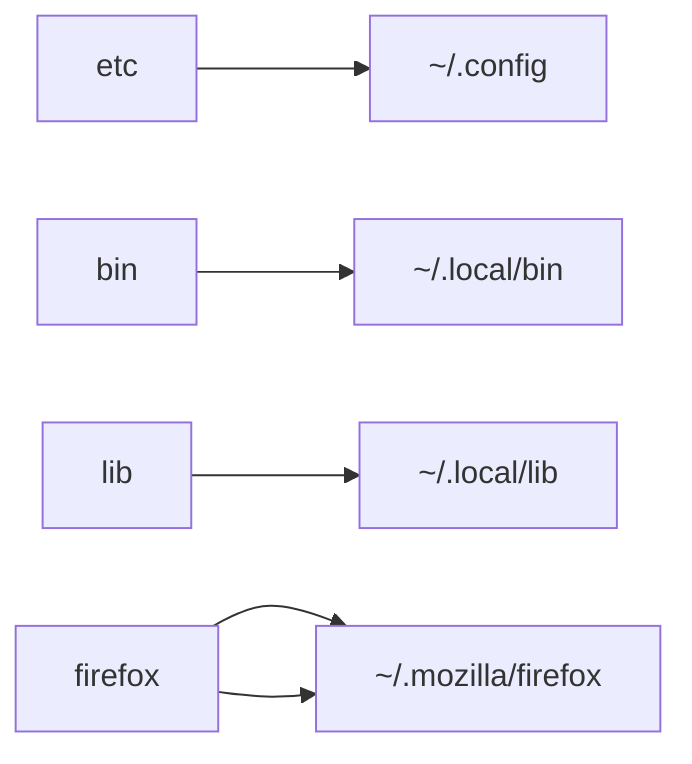
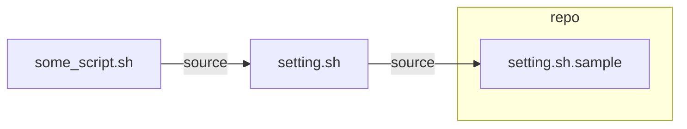

# Carnivuth's dotfiles

Personal dotfiles (wayland configuration) + some useful scripts and tools for everyday use

## Features

The repo contains a bunch of scripts and utilities for day to day use, it's almost as a fully desktop environment (at least for my use case 😅), some of the features are

- dotfiles for a wayland(*[Hyprland](https://hyprland.org/)*) configuration for keybindings (mostly like [i3](https://i3wm.org/) ones)
- default configuration for some softwares that i use every day, Picard, firefox etc
- Automatic backups using systemd timers and borg
- nextcloud sync daemon
- script menu to interact with the system

## Installation

In order to install the repository clone the repository and run the make target, it's recommended to clone it under the home user directory (*`$HOME`*)

```bash
make install
```

### What does the installation target do

The target will link the repository content (e.g. bash scripts, systemd units,dotfiles and general content) using stow following this file structure


```mermaid
flowchart LR
A[etc] --> E[~/.config]
B[bin] --> F[~/.local/bin]
C[lib] --> G[~/.local/lib]
D[systemd] --> H[~/.config/systemd/user]
D[firefox] --> H[~/.mozilla/firefox]
```

The target will also add to the `~/.bashrc` an include line to enable common aliases for the scripts inside the repository

### Configure firefox

To make the `userChrome.css` file valid the option `toolkit.legacyUserProfileCustomizations.stylesheets` must be enabled in the `about:config` firefox panel

### System wide configuration

The install target runs also other system wide configurations (*`sudo` is required*) such as:

- greeter and `greetd` configuration
- sudo configuration for the current user `$USER` (*this is mandatory to run hooks on update*)
- `pam` configuration for unlocking gnome key ring on login

### Greeter configuration

The install target installs `greetd` as a login daemon and `hyprland` and sway as window managers, configuration is done for both the environments (`hyprland` is more updated since is my default one), to set one of them as default program after login edit `/etc/greetd/config.toml` following the file [here](./sys/greetd/config.toml)

## Configuration

> [!ALERT]
> The paths in this page are all links generated at the installation phase using stow, refer to the [installation phase](#installation) for the general structure

### Configuration file structure

Configuration is done trough 2 main files:

- `$HOME/.config/scripts/settings.sh.sample` this is the default configuration file that is **versioned** inside the repository and should be used as reference and **never edited**
- `$HOME/.config/scripts/settings.sh` this is the main configuration file that is generated from the installation script and sources the sample one

All scripts and lib files sources the `settings.sh` file that sources the sample one


```mermaid
flowchart LR
A[some_script.sh]
B[setting.sh]
subgraph repo
C[setting.sh.sample]
end
A -- source --> B -- source -->  C
```

### Editing the configuration file

In order to edit the configuration file copy the interested variable from the `settings.sh.sample` file inside the `settings.sh` file following the comments guidelines inside the sample file, for example to change the subsonic api endpoint add this to `settings.sh`:

```bash
SUBSONIC_API_ENDPOINT="your-endpoint"
```
